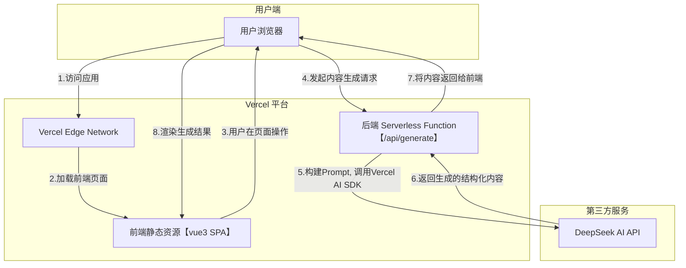

# 小红书内容生成器(AI Agent)

- 编号: #14
- 链接: https://github.com/Daotin/ai-coding/issues/14
- 状态: open
- 创建时间: 2025-10-28
- 更新时间: 2025-10-28
## 需求分析

仓库地址：https://github.com/Daotin/vercel-monorepo-demo/tree/xhs-creator

## 架构设计

该项目采用基于 pnpm workspace + Turbo 的 Monorepo 架构，实现了前后端分离。前端是一个 Vue 3 单页应用，后端是基于 Vercel 的 Serverless Functions。整体部署在 Vercel平台上，实现了 CI/CD 和一体化托管。

其核心思想是利用 Vercel AI SDK 调用大语言模型（如 DeepSeek）的能力，将用户输入的非结构化文本（主题、关键词）和风格偏好，通过精心设计的Prompt，转化为符合小红书平台调性的结构化内容（标题、正文、标签）。

### 架构风格

### 技术栈

架构：pnpm workspace +turborepo + monorepo

前端技术栈：Vite+Vue全家桶（element plus, axios, @vueuse/core, typescript）

后端技术栈：nodejs + Vercel Serverless Function + Vercel AI SDK + DeepSeek API

### 系统部署架构图



流程说明:

1. 用户通过浏览器访问应用，Vercel Edge Network 提供服务。
2. 浏览器加载部署在 Vercel 上的 Vue.js 前端应用。
3. 用户在前端页面输入内容主题和选择风格，点击“生成”按钮。
4. 前端通过 Axios 向后端的 /api/generate 接口（一个 Vercel Serverless Function）发起 POST 请求。
5. 后端服务接收到请求后，首先使用 Zod 验证参数，然后通过 PromptBuilder 构建一个详细的 Prompt，并利用 Vercel AI SDK 的 generateText 和 tool 功能调用
DeepSeek AI 服务。
6. DeepSeek 模型根据 Prompt 指令，生成结构化的 JSON 内容并返回。
7. 后端服务将 AI 返回的 JSON 数据包装后，响应给前端。
8. 前端接收到数据，更新页面状态，并将生成的标题、正文和标签渲染到前端 ResultDisplay 组件中。

## 接口设计

系统核心接口只有一个，用于内容生成。

```tsx
// POST /api/generate
interface GenerateRequest {
  content: string; // 用户输入内容, 1-200字符
  style: '简约风格' | '商务专业' | '文艺优雅' | '轻松幽默' | '干货教程'; // 内容风格
}
```

```tsx
// HTTP 200
{
  "success": true,
  "data": {
    "title": "string", // 包含emoji的标题
    "body": "string", // 正文内容, 200-400字
    "hashtags": ["string", "..."] // 3-5个话题标签
  },
  "timestamp": 1678886400000
}

// HTTP 500
{
  "success": false,
  "error": {
    "code": "INTERNAL_ERROR",
    "message": "内容生成失败，请稍后重试"
  },
  "timestamp": 1678886400000
}
```

## 数据设计

 本项目不涉及持久化数据库，其数据设计主要体现在API数据结构和AI模型交互的结构化数据上。

- API 数据结构: 如上“接口设计”部分所述，GenerateRequest 和 GenerateResponse 定义了清晰、类型安全的前后端交互数据格式。
- AI Prompt 与结构化输出: 这是数据设计的核心。
- 强制结构化输出 (`AIService`): 为了确保 AI 总能返回可被程序解析的正确 JSON，后端利用了Vercel AI SDK 的 tool 功能和 Zod。它定义了一个 contentSchema(Zod Schema)，并将其作为tool 的 inputSchema。这会强制 AI 模型调用这个“工具”来输出内容，从而保证了输出结果的结构和类型与 contentSchema完全一致，极大地提升了系统的稳定性。
    
    ```tsx
    // src/services/ai-service.ts
    const contentSchema = z.object({
      title: z.string().describe('...'),
      body: z.string().describe('...'),
      hashtags: z.array(z.string()).describe('...'),
    });
    
    // ...
    await generateText({
      model: deepseek('deepseek-chat'),
      prompt,
      tools: {
        outputContent: tool({
          description: '...',
          inputSchema: contentSchema,
        }),
      },
    });
    ```
    

## 部署

见：[使用 Vercel 部署前端项目](https://daotin.github.io/posts/2025/09/15/vercel.html)

## 开发问题汇总

1、Vercel AI SDK 调用 Google Gemini，一直显示网络异常，遂放弃使用DeepSeek API

2、如何读取的密钥，比如DEEPSEEK_API_KEY？
- 本地环境：使用根目录的 .env 文件。Vercel CLI (vercel dev) 会自动加载。
- 部署环境，需要通过 Vercel 的控制台来设置环境变量。完成这些步骤后，Vercel 会在构建和运行你的应用时，自动将这个密钥注入到运行环境中。你的代码（例如
packages/server/src/services/ai-service.ts）就能通过 process.env.DEEPSEEK_API_KEY 读取到这个值了。

3、如何使用 Vercel AI SDK + DeepSeek API完成与AI的交互？

Vercel AI SDK 为我们屏蔽了底层复杂的 API请求、认证和数据流处理，让我们可以用统一、简洁的方式调用包括 DeepSeek 在内的多种 AI 模型。

- 后端（服务端）：创建一个 API 端点（例如，在 Vercel 上就是一个 Serverless Function），它会接收前端的请求，然后使用 Vercel AI SDK 调用DeepSeek API。
- Provider (提供商): @ai-sdk/deepseek 是 DeepSeek 的官方提供商包。我们用它来创建一个模型实例。

```tsx
// packages/server/api/chat.ts

  import { deepseek } from '@ai-sdk/deepseek';
  import { streamText } from 'ai';
  import type { VercelRequest, VercelResponse } from '@vercel/node';

  // 告诉 Vercel 这个函数应该在 Edge Runtime 上运行，速度更快
  // 这是一个 Vercel 的配置，它让这个无服务器函数运行在更靠近用户的边缘网络上，可以显著降低延迟。
  export const config = {
    runtime: 'edge',
  };

  export default async function handler(req: Request) {
    // 必须是 POST 请求
    if (req.method !== 'POST') {
      return new Response('Method Not Allowed', { status: 405 });
    }

    // 从请求体中解析出消息
    // Vercel AI SDK 的前端辅助工具（如 useChat）会使用这个结构
    const { messages } = await req.json();

    // 调用 AI SDK 的 streamText 函数
    const result = await streamText({
      // 1. 指定模型
      // Vercel AI SDK 会自动从环境变量 DEEPSEEK_API_KEY 读取密钥
      model: deepseek('deepseek-chat'),

      // 2. 传入消息历史
      messages: messages,

      // 可选：在这里可以添加其他参数，比如 temperature, maxTokens 等
    });

    // 3. 将模型的输出流直接转换为一个符合规范的流式响应
    return result.toAIStreamResponse();
  }
```

4、使用node开发后端部署到vercel需要遵循什么规范？

将 Node.js 后端部署到 Vercel 需要遵循其 Serverless Functions（无服务器函数）模型的规范。这套规范旨在实现高性能、高可扩展性和易于部署。

以下是你需要遵循的核心规范和最佳实践：

- 文件和目录结构 (File-based Routing)
    - `api` 目录: 所有后端 API 代码必须放在项目根目录下的 api 文件夹中。
    在你的项目中，后端代码位于 packages/server，Vercel 的配置（可能在 vercel.json
    或项目设置中）会指定这个包作为其中一个应用的根目录，因此 Vercel 会在该目录中寻找 api 文件夹。
    - 函数签名
        
        ```tsx
        // Node.js Runtime (默认)
        import type { VercelRequest, VercelResponse } from '@vercel/node';
        
        export default function handler(req: VercelRequest, res: VercelResponse) {
          const { name = 'World' } = req.query;
          res.status(200).send(Hello, ${name}!);
        }
        
        // Edge Runtime
        export const config = {
          runtime: 'edge', // 关键配置
        };
        // 注意 handler 的签名也变了
        export default async function handler(req: Request) {
          // ... 使用 fetch API 标准的 Request 和 Response 对象
          return new Response('Hello from the Edge!');
        }
        ```
        
        *最佳实践：使用 @vercel/node 包提供的类型 VercelRequest 和 VercelResponse 来获得更好的类型提示。*
        

Monorepo 配置：

| 规范/实践 | 关键点 |
| --- | --- |
| 代码位置 | 放在 api 目录下，文件名即路由。 |
| 函数格式 | export default function handler(req, res) { ... }。 |
| 依赖 | 在 package.json 的 dependencies 中声明。 |
| 配置/密钥 | 使用环境变量，不要硬编码。 |
| 性能 | 优先考虑使用 runtime: 'edge'，特别是对于 AI 流式响应。 |
| 架构 | 保持函数无状态，将状态存储在外部数据库或缓存中。 |
| Monorepo | 确保 Vercel 项目设置与你的仓库结构（packages/*）匹配。 |

5、对于@server/ ，不需要打包成一个入口bundle.js文件吗？

不需要。Vercel 会把 `packages/server/api/*.ts` 中的每个文件当作独立入口分别编译/打包并部署，无需手动合并成单一的 bundle.js（除非你有特殊自定义构建需求）。
